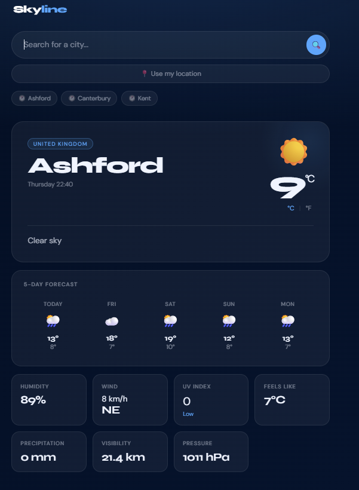

# Skyline Weather 🌤️

A responsive weather application that provides real-time weather data and 5-day forecasts for any city in the world, with support for geolocation detection.

🔗 **Live Site:** [Skyline Weather](https://hybrid965.github.io/Skyline-Weather-App/)

---

## Screenshots



---

## Features

- 🔍 Search weather by city name
- 📍 Auto-detect current location via browser Geolocation API
- 🌡️ Toggle between °C and °F
- 📅 5-day weather forecast
- 📊 Detailed weather metrics:
  - Humidity
  - Wind speed
  - UV Index
  - Feels like temperature
  - Precipitation
  - Visibility
  - Sunrise & Sunset times

---

## Tech Stack

- **HTML5** — Semantic structure
- **CSS3** — Responsive layout and styling
- **JavaScript (ES6+)** — Application logic and DOM manipulation
- **[Open-Meteo API](https://open-meteo.com/)** — Free weather data, no API key required
- **Browser Geolocation API** — Native device location detection with reverse geocoding

---

## How It Works

1. On load, the app prompts the user to allow location access
2. If granted, the browser's native Geolocation API returns the user's coordinates, which are then reverse geocoded to display a location name
3. Weather data is fetched from the Open-Meteo API using `.then()` promise chaining
4. Users can also search for any city manually and toggle between metric and imperial units

---

## Challenges & What I Learned

**Error handling complexity** — One of the trickier aspects of this project was maintaining robust error handling across multiple async API calls. When adding new features, existing error handlers occasionally broke due to unhandled promise rejections or mismatched response structures. This reinforced the importance of planning error handling upfront rather than retrofitting it, and gave me solid experience debugging async JavaScript flows.

**Geolocation + reverse geocoding pipeline** — Chaining the geolocation permission, coordinate retrieval, and reverse geocode lookup into a clean promise chain required careful handling of each step's success and failure states independently.

---

## Running Locally

No build tools or dependencies required.

```bash
git clone https://github.com/Hybrid965/Skyline-Weather-App.git
cd Skyline-Weather-App
open index.html
```

Or simply open `index.html` directly in your browser.

---

## Future Improvements

- Hourly forecast view
- Weather alerts / severe weather warnings

---

## Author

**Will** — [GitHub](https://github.com/Hybrid965) | [Portfolio](https://hybrid965.github.io/portfolio)